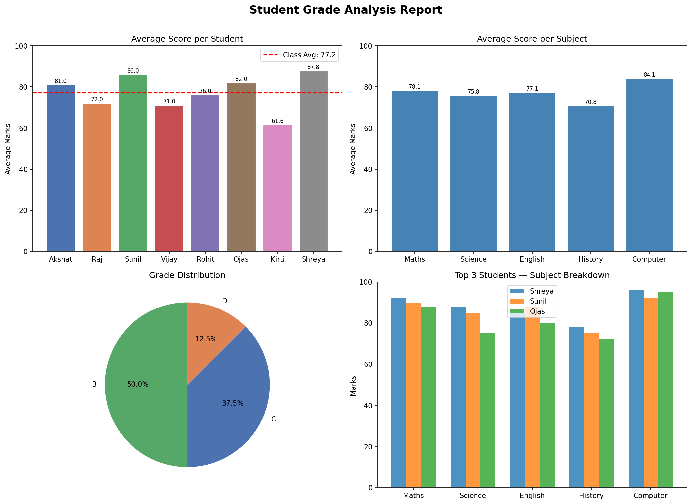

# 📊 Student Grade Analyzer

A Python data analysis project that automatically analyzes 
student marks across multiple subjects and generates a 
complete visual performance report.

## 🔍 What It Does

- Calculates total marks, average, percentage and grade 
  for each student
- Identifies class topper and subject-wise averages
- Flags students who need improvement
- Assigns grades automatically (A+, A, B, C, D, F)
- Generates a 4-chart visual dashboard

## 📈 Visual Report Includes

- Average score per student vs class average benchmark
- Subject-wise performance breakdown across all students
- Grade distribution pie chart
- Top 3 students subject-by-subject comparison

## 🛠️ Built With

- Python
- Pandas
- Matplotlib
- NumPy

## 🚀 How to Run

1. Open the notebook in Google Colab
2. Run all cells in order
3. The visual report generates and saves automatically 
   as grade_report.png

## 📷 Output

